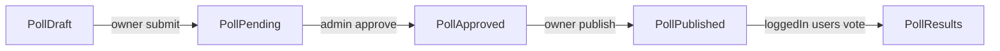

# Polls-to-Petitions Parity Refactor Plan

## Goal

Make Polls follow the same workflow contract as Petitions while preserving Poll-specific behavior (question/options voting instead of signatures):

- `draft` -> `pending` -> `approved` -> `published`
- owner-managed gating criteria (NFT/FT policy)
- admin review/approval
- owner publish action
- public voting/results for logged-in users

## Current Gaps Confirmed

- Public Poll routes/controller are missing submit/publish/manage/edit workflow actions in [application/routes/web.php](application/routes/web.php) and [application/app/Http/Controllers/PollController.php](application/app/Http/Controllers/PollController.php).
- Admin Poll flow only approves status, no parity with review lifecycle controls in [application/app/Http/Controllers/Admin/PollController.php](application/app/Http/Controllers/Admin/PollController.php).
- Poll list/UI expects published data while creation defaults to pending in [application/database/migrations/2024_01_19_092732_create_polls_table.php](application/database/migrations/2024_01_19_092732_create_polls_table.php).
- Poll criteria UI currently points to Petition rule endpoints in [application/resources/js/shared/components/Criteria.vue](application/resources/js/shared/components/Criteria.vue).
- No Poll feature tests (Petition has flow coverage in [application/tests/Feature/PetitionFlowTest.php](application/tests/Feature/PetitionFlowTest.php)).

## Target Architecture

## Implementation Steps

1. **Backend lifecycle parity (routes + controller actions)**

- Add Poll routes analogous to Petition routes in [application/routes/web.php](application/routes/web.php):
  - `polls.manage`, `polls.edit`, `polls.submit`, `polls.publish`, `polls.destroy` (draft-only delete if required by parity)
  - Poll rule routes under `/{poll}/rules` (create/save/delete modal pattern)
- Extend [application/app/Http/Controllers/PollController.php](application/app/Http/Controllers/PollController.php) with:
  - `manage()`, `edit()`, `submitForReview()`, `publish()`, rule CRUD modal handlers
  - status guardrails matching Petition checks (`draft` required for submit, `approved` for publish)
  - set `started_at` on publish
- Ensure `store()` explicitly creates Poll as `draft` and redirects into step workflow.

1. **Data model + DB support for Poll gating rules (chosen approach)**

- Create `poll_rule` pivot migration (parallel to petition_rule) and wire relation:
  - add `rules()` relationship on [application/app/Models/Poll.php](application/app/Models/Poll.php)
- Add rule association handlers in Poll controller using existing `rules` table and validation pattern from Petition (`type`, `title`, normalized 56-char hex policy).
- Add follow-up migration to change polls default status from `pending` to `draft` in DB.

1. **Authorization parity for Poll operations**

- Add Poll policy mirroring owner-based operations in [application/app/Policies/PetitionPolicy.php](application/app/Policies/PetitionPolicy.php): view, create, update, publish, delete/vote permissions as needed.
- Register policy and replace inline auth checks in Poll controller with policy/gate checks for consistency.

1. **Frontend workflow parity (full parity option selected)**

- Create Poll workflow and management pages patterned after Petition pages:
  - new step pages under `resources/js/Pages/Poll/Workflows/`*
  - new `resources/js/Pages/Poll/Manage.vue`
  - new publish modal `resources/js/Pages/Poll/Partials/PublishPoll.vue`
- Update [application/resources/js/Pages/Poll/Create.vue](application/resources/js/Pages/Poll/Create.vue) to become step-based entry (like Petition StepOne/StepTwo/StepThree pattern adapted for poll question/options).
- Update [application/resources/js/shared/components/Criteria.vue](application/resources/js/shared/components/Criteria.vue) to route by model type (Poll vs Petition), so Poll criteria operations hit Poll rule endpoints.
- Add/edit Poll list item actions so owner/admin states and call-to-actions reflect lifecycle status accurately.

1. **Admin review UX parity for Polls**

- Expand [application/app/Http/Controllers/Admin/PollController.php](application/app/Http/Controllers/Admin/PollController.php) and admin Poll views to support clear review state transitions (approve/reject for `pending`).
- Ensure admin pages surface Poll status transitions similarly to Petition admin workflows.

1. **Voting + results integrity checks**

- Keep Poll-specific vote mechanics, but enforce voting eligibility against Poll rules (NFT/FT gating) before storing responses.
- Ensure public lists (`browse`, `active`, `pending`, `answered`) map correctly to new lifecycle states and only show published polls in browse.

1. **DTO/contract normalization for frontend stability**

- Update [application/app/DataTransferObjects/PollData.php](application/app/DataTransferObjects/PollData.php) to include fields needed by lifecycle pages (`started_at`, `ended_at`, owner/rules context consistency).
- Ensure query parameter and payload handling between `poll-store` and backend endpoints is consistent for pagination and status filters.

1. **Automated tests (required)**

- Add Poll feature tests similar in spirit to Petition flow coverage:
  - create as draft
  - submit for review
  - admin approve/reject
  - owner publish sets `started_at`
  - browse returns only published polls
  - rule policy validation + gated voting pass/fail
- Keep tests in `application/tests/Feature/`* and run targeted Pest suite for changed behavior.

1. **Validation + formatting pass**

- Run targeted tests for Poll flow.
- Run Laravel Pint on dirty PHP files.
- Verify no new lint issues in touched frontend files.

## Key Files Expected to Change

- [application/routes/web.php](application/routes/web.php)
- [application/routes/admin.php](application/routes/admin.php)
- [application/app/Http/Controllers/PollController.php](application/app/Http/Controllers/PollController.php)
- [application/app/Http/Controllers/Admin/PollController.php](application/app/Http/Controllers/Admin/PollController.php)
- [application/app/Models/Poll.php](application/app/Models/Poll.php)
- [application/app/DataTransferObjects/PollData.php](application/app/DataTransferObjects/PollData.php)
- [application/resources/js/shared/components/Criteria.vue](application/resources/js/shared/components/Criteria.vue)
- [application/resources/js/Pages/Poll/*](application/resources/js/Pages/Poll/)
- new migration(s) for `poll_rule` and default status alignment
- new Poll feature test file(s) in [application/tests/Feature](application/tests/Feature)

